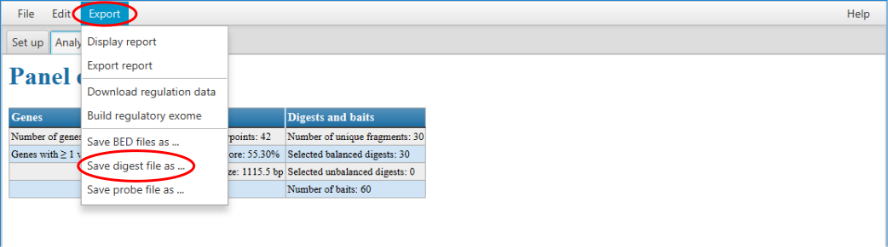
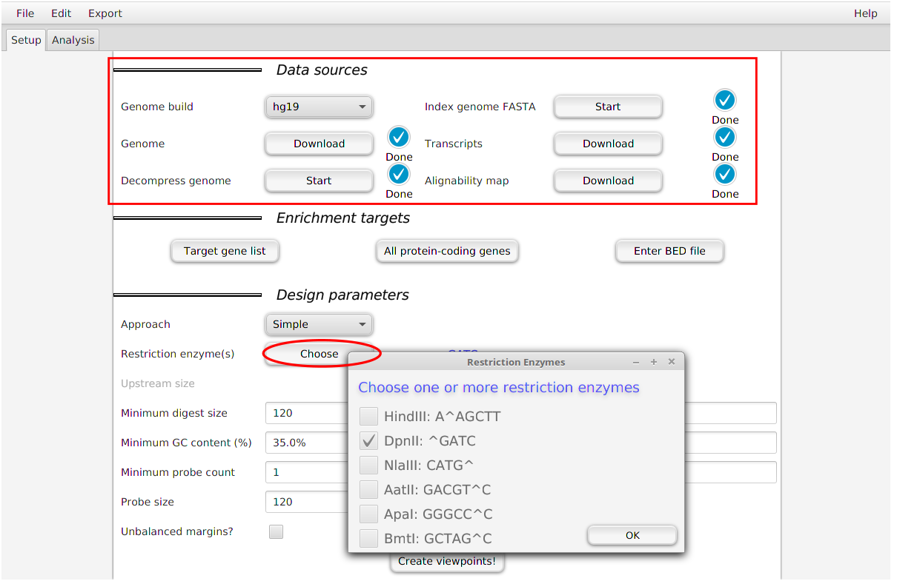

.. _rstdigest:

Creating an *in silico* restriction digest map for Diachromatic using GOPHER
============================================================================

The Capture Hi-C (CHC) protocol involves the restriction digestion of a sample and the downstream analysis assigns
reads to pairs of restriction digests. Therefore, the ``align`` subcommand of Diachromatic requires a list of all
restriction digests that result from the *in silico* digestions of a given genome with the chosen enzyme or enzymes.
Such lists can be generated using the GOPHER_ software. The TSV
formatted file exported from GOPHER can be passed to Diachromatic using the ``-d`` or ``digest`` option.

.. _GOPHER: https://github.com/TheJacksonLaboratory/Gopher

Performing the in silico digest using GOPHER
~~~~~~~~~~~~~~~~~~~~~~~~~~~~~~~~~~~~~~~~~~~~

If the GOPHER software was used for the design of the given capture Hi-C experiment, you can just open the corresponding
GOPHER project and export the required file via the export menu. In such cases the exported file also includes the
information about enriched and non-enriched digests, i.e. if there are enrichment probes associated with given digests.

If you did not  design CHC probes using GOPHER, you can still use diachromatic, but will need to create file with
the same format. It is easy to do so with the GOPHER software. First, `setup a new project`_, and then
specify the parameters in the *Data sources* section and the restriction enzyme in the
*Design parameters* section. If you prepare the digest map in this way, all digests will be marked as inactive
(i.e., not enriched with capture probes). In order to use some features of Diachromatic, you will need to change
the digest file to indicate which
digests where chosen for enrichment (for instance, with a Python script).

.. _setup a new project: https://gopher.readthedocs.io/en/latest/02_gui_data.html

Format of the digest file
~~~~~~~~~~~~~~~~~~~~~~~~~

The first line of this file contains the column names, and all other lines correspomd to one restriction digest.
Each line consists of 14 fields that are described in the table .

+--------+-------------------------+----------+------------------------------------------------------------------------------------------------------------------------------------------+
| Column | Name                    | Example  | Description                                                                                                                              |
+--------+-------------------------+----------+------------------------------------------------------------------------------------------------------------------------------------------+
| 1      | Chromosome              | chr1     | Name of the reference sequence.                                                                                                          |
+--------+-------------------------+----------+------------------------------------------------------------------------------------------------------------------------------------------+
| 2      | Digest_Start_Position   | 18376    | 1-based start position of the restriction digest.                                                                                        |
+--------+-------------------------+----------+------------------------------------------------------------------------------------------------------------------------------------------+
| 3      | Digest_End_Position     | 18392    | 1-based end position of the restriction digest.                                                                                          |
+--------+-------------------------+----------+------------------------------------------------------------------------------------------------------------------------------------------+
| 4      | Digest_Number           | 42       | Consecutive digest number.                                                                                                               |
+--------+-------------------------+----------+------------------------------------------------------------------------------------------------------------------------------------------+
| 5      | 5'_Restriction_Site     | DpnII    | Name of the enzyme responsible for the cut at the 5' end of the digest.                                                                  |
+--------+-------------------------+----------+------------------------------------------------------------------------------------------------------------------------------------------+
| 6      | 3'_Restriction_Site     | DpnII    | Name of the enzyme responsible for the cut at the 3' end of the digest. May be different from field 5 if more than one enzyme is used.   |
+--------+-------------------------+----------+------------------------------------------------------------------------------------------------------------------------------------------+
| 7      | Length                  | 1245     | Length of the digest.                                                                                                                    |
+--------+-------------------------+----------+------------------------------------------------------------------------------------------------------------------------------------------+
| 8      | 5'_GC_Content           | 0.500    | GC content of the upstream margin (GOPHER's default margin size is 250 bp).                                                              |
+--------+-------------------------+----------+------------------------------------------------------------------------------------------------------------------------------------------+
| 9      | 3'_GC_Content           | 0.500    | GC content of the downstream margin.                                                                                                     |
+--------+-------------------------+----------+------------------------------------------------------------------------------------------------------------------------------------------+
| 10     | 5'_Repeat_Content       | 0.138    | Repeat content of the upstream margin.                                                                                                   |
+--------+-------------------------+----------+------------------------------------------------------------------------------------------------------------------------------------------+
| 11     | 3'_Repeat_Content       | 0.126    | Repeat content of the downstream margin.                                                                                                 |
+--------+-------------------------+----------+------------------------------------------------------------------------------------------------------------------------------------------+
| 12     | Enrichment status       | T (or F) | Enrichment status of the digest. A digest is considered enriched, if it has at least one probe.                                          |
+--------+-------------------------+----------+------------------------------------------------------------------------------------------------------------------------------------------+
| 13     | 5'_Probes               | 2        | Number of probes for the upstream margin.                                                                                                |
+--------+-------------------------+----------+------------------------------------------------------------------------------------------------------------------------------------------+
| 14     | 3'_Repeat_Content       | 0        | Number of probes for the downstream margin.                                                                                              |
+--------+-------------------------+----------+------------------------------------------------------------------------------------------------------------------------------------------+

