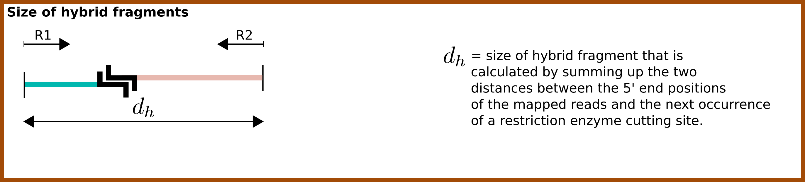

Mapping and categorization of Hi-C paired-end reads
===================================================

Independent mapping of forward and reverse paired-end reads using bowtie2
~~~~~~~~~~~~~~~~~~~~~~~~~~~~~~~~~~~~~~~~~~~~~~~~~~~~~~~~~~~~~~~~~~~~~~~~~

The two reads of a valid Hi-C read pair come from two different interacting genomic regions that can be
separated by a large number of nucleotides within the same chromosome (**cis interactions**) or even be located on
different chromosomes (**trans interactions**). For this reason, the distance between the two 5' end positions of the
mapped reads can no longer be interpreted as the classical *insert size*, and the truncated forward (R1) and reverse
(R2) reads have to be mapped independently.

Diachromatic executes ``bowtie2`` separately for R1 and R2 with the ``--very-sensitive`` option.
Read pairs for which at least one read cannot be mapped uniquely are discarded.
Diachromatic provides two levels of stringency for the definition of multi-mapped reads:
    1. **Very stringent mapping:** There is no second best alignment for the given read. In this case the line in the SAM record produced by ``bowtie2`` contains no ``XS`` tag. Use Diachromatic's ``--bowtie-stringent-unique`` or ``-bsu`` option in order to use this level of stringency.
    2. **Less stringent mapping:** There can be a second best alignment, but the score of the alignment (MAPQ) needs to e greater or equal than 30 and the difference of the mapping scores between the best and second best alignment must be greater or equal than 10 (c.f. `HiCUP <https://www.bioinformatics.babraham.ac.uk/projects/hicup/>`_). Diachromatic uses this option by default.

Pairing of properly mapped read pairs
~~~~~~~~~~~~~~~~~~~~~~~~~~~~~~~~~~~~~

The independently mapped reads are written to two temporary SAM files, whereby the order of read records in the
truncated FASTQ files is retained by using bowtie2's option ``--reorder``. In the next step, Diachromatic iterates
simultaneously over the two SAM files.
Read pairs for which both reads can be mapped uniquely are paired, i.e. the two SAM records for single-end reads are
combined into one paired-end record with appropriate SAM flags reflecting the relative orientation of the reads.

Formation process of Hi-C fragments
~~~~~~~~~~~~~~~~~~~~~~~~~~~~~~~~~~~

Paired read pairs are futher subdivided into valid and artefactual read pairs.
In order to understand how Diachromatic determines whether a read pair is valid or not, it is important to think
through the formation process on the fragment level.
Hi-C fragments arise from cross-linked chromatin that is processed in three successive experimental steps:
*restriction digest*, *re-ligation* and *shearing* (see illustration below).

.. figure:: img/fragment_formation.png
    :align: center

For Hi-C, cross-linked chromatin is digested using one or more restriction enzymes,
which results in restriction fragments whose ends re-ligate thereby forming ligation junctions.
The shearing step introduces DNA breakpoints representing a second type of fragment ends in addition those introduced
by digestion. Fragment ends corresponding to restriction enzyme cutting sites are generally referred to as
*dangling ends* because they failed to re-ligate.

Essentially, three fragment categories are distinguished within Diachromatic: **hybrid fragments** that arise from
re-ligation between ends of different restriction fragments and two artifact categories that correspond to single
restriction fragments whose ends failed to re-ligate with other fragments, either because both ends remained **un-ligated**
or **self-ligated** with each other. Hybrid fragments may correspond to valid interactions but also to cross-ligation
artifacts depending on whether the re-ligation occurred within the same protein-DNA complex or between different complexes, respectively.
Paired-end sequencing of hybrid fragments may results in all possible relative orientations, i.e. reads of given pairs
may point *inwards*, *outwards* or in the *same direction*.
In contrast to that, sequencing of un-ligated fragments results in inward pointing pairs only, and sequencing of
self-ligated fragments results in outward pointing pairs only.
Due to the fact that the read pair orientations overlap
for the different categories, the identification of read pairs arising from un-ligated or self-ligated fragments
additionally requires the definition of size thresholds that will be introduced below.

Sizes of hybrid fragments
-------------------------

Read pairs arising from hybrid fragments may have all possible relative orientations, and the size needs to be calculated
in consideration of the Hi-C protocol.
This size is here referred to as d\ :sub:`h` and calculated as the sum of the two distances between the 5' ends of the
mapped reads and the next occurrence of a cutting motif in 3' direction which is assumed to correspond to the ligation
junction (`Wingett 2015 <https://www.ncbi.nlm.nih.gov/pubmed/26835000/>`_).

We assume that the size distribution of hybrid fragments results from the parameters used for shearing
and thus corresponds to overall fragment size distribution in the sequencing library.
Diachromatic uses lower and upper thresholds T1\ :sub:`min` and T1\ :sub:`max` for valid sizes of sheared fragments that
need to be specified by the user.
Read pairs arising from hybrid fragments with a calculated size d\ :sub:`h` outside the specified range are categorized
as *too small* or *too large* artifacts.
All other read pairs arising from hybrid fragments are defined to be *valid pairs* that can be used for downstream
analysis.

Sizes of un-ligated fragments
-----------------------------

Read pairs arising from un-ligated fragments must point inwards, and the fragment size simply corresponds to the
distance between the 5' end positions of the two reads. This distance is here referred to as d\ :sub:`u`.

.. figure:: img/fragment_size_unligated.png
    :align: center

In order to distinguish between read pairs arising from hybrid and un-ligated fragments, Diachromatic uses the same
upper threshold T\ :sub:`1` that is also used for the categorization of too large hybrid fragments.
This is because we assume the size distributions of hybrid and un-ligated fragments result from the same shearing
treatment.
Inward pointing read pairs for which d\ :sub:`u` is smaller than the specified threshold T\ :sub:`1` are categorized as
un-ligated pairs.

Sizes of self-ligated fragments
-------------------------------

Unlike reads arising from un-ligated fragments, reads arising from self-ligated must point outwards.
Furthermore, self-ligating fragments have a different size distribution than hybrid and un-ligated fragments.
The relevant size is no longer the size of the sequenced fragments that results from shearing but the
favourable size at which fragments tend to self-ligate.
Very short fragments might not self-ligate because of steric hindrance, whereas the ends of very long fragments might
be unlikely to become located in sufficient physical proximity in order to ligate.
Within Diachromatic, the size of self-ligating fragments is calculated as the sum d\ :sub:`s` = d\ :sub:`h` + d\ :sub:`u`,
where d\ :sub:`u` is the distance between the 5' end positions of the two reads, and d\ :sub:`h` is the sum of the two
distances between the 5' ends of the mapped reads and the next occurrence of a cutting motif in 3' direction.

.. figure:: img/fragment_size_selfligated.png
    :align: center

Diachromatic uses a self-ligation threshold T\ :sub:`2`.
Outward pointing read pairs for which the calculated size d\ :sub:`s` of the underlying self-ligated fragment is smaller than this
threshold are are categorized as self-ligated pairs.

Categorization of read pairs
----------------------------

The illustration below shows the decision tree for the categorization of read pairs.

.. figure:: img/fragment_categories.png
    :align: center

The next four paragraphs explain the categorization along the bullets points 1 to 4 (blue):

**1.** Read pairs that map to different chromosomes or point in the same direction cannot originate from un-ligated or self-ligated fragments.

**2.** Read pairs that point inwards might originate from un-ligated fragments. In such cases, the distance between the 5' end positions of the mapped reads d\ :sub:`u` corresponds to the size of the  sequenced fragment. In order to assign read pairs to the un-ligated category, we use an upper size threshold T\ :sub:`1` that should reflect  the maximum credible size of sheared fragments.

**3.** Read pairs that point outwards might originate from self-ligated fragments. In such cases, the size d\ :sub:`s` of the potentially underlying self-ligated fragment is calculated as described above, and compared to an upper size threshold T\ :sub:`2` for self-ligated fragments. Outward pointing read pairs with d\ :sub:`s` smaller than T\ :sub:`2` are assigned to the self-ligated category.

**4.** Read pairs arising from hybrid fragments (not un- or self-ligated) are further distinguished. Read pairs with size d\ :sub:`s` outside the specified size range of sheared fragments will be categorizesd as wrong size.

Quality metrics
~~~~~~~~~~~~~~~

Cross-ligation coefficient (CLC)
--------------------------------

Valid read pairs arising from genuine chromatin-chromatin interactions cannot be distinguished from those arising from
**cross-ligation** events.
However, the overall extend of **cross-ligation** is estimated for given experiments.
Based on the assumption that cross-ligation between DNA fragments of different chromosomes (trans) occurs more likely
as compared to cross-ligation between DNA fragments of the same chromosome (cis), the ratio of the numbers of cis
and trans read pairs is taken as an indicator of poor Hi-C libraries that contain lots of false positive interaction
pairs arising from spurious cross-ligation events (Wingett 2015, Nagano 2015).

Fraction of singleton interactions (FSI)
----------------------------------------

It has been pointed out that the Cis/Trans ratio quality measure depends also on other factors such as the genome size and
number of chromosomes of the analyzed species (Wingett 2015). Diachromatic provides an alternative and possibly more robust quality metric that
can be used to access the extent of cross-ligation. Amongst the trans read pairs, we generally observe a large proportion
of restriction fragments that are connected by single read pairs only. The number of all possible different cross-ligation
events (including cis and trans) can roughly be estimated as the square number of all restriction fragments across the
entire genome. Given this huge number, we reasoned that it is very unlikely that the same cross-ligation event occurs
twice. Therefore, we defined the fraction of singleton interactions as the ratio of singleton read pairs and all read pairs.

Running Diachromatic's align subcommand
~~~~~~~~~~~~~~~~~~~~~~~~~~~~~~~~~~~~~~~

Use the following command to run the alignment and counting step. ::

    $ java -jar target/Diachromatic.jar map -b /usr/bin/bowtie2 -i /data/bt_indices/hg38 -q prefix.truncated_R1.fq.gz -r prefix.truncated_R2.fq.gz -d hg38_DpnII_DigestedGenome.txt

+--------------+----------------------+--------------------------------------------------------+----------+----------------------------------------------------------------------+---------+
| Short option | Long option          | Example                                                | Required | Description                                                          | Default |
+--------------+----------------------+--------------------------------------------------------+----------+----------------------------------------------------------------------+---------+
| -q           | --fastq-r1           | prefix.truncated_R1.fq.gz                              | yes      | Path to the truncated forward FASTQ file.                            |    --   |
+--------------+----------------------+--------------------------------------------------------+----------+----------------------------------------------------------------------+---------+
| -r           | --fastq-r2           | prefix.truncated_R2.fq.gz                              | yes      | Path to the truncated reverse FASTQ file.                            |    --   |
+--------------+----------------------+--------------------------------------------------------+----------+----------------------------------------------------------------------+---------+
| -b           | --bowtie2            | /tools/bowtie2-2.3.4.1-linux-x86_64/bowtie2            | yes      | Path to bowtie2 executable.                                          |    --   |
+--------------+----------------------+--------------------------------------------------------+----------+----------------------------------------------------------------------+---------+
| -i           | bowtie2-index        | /data/indices/bowtie2/hg38/hg38                        | yes      | Path to bowtie2 index of the corresponding genome.                   |    --   |
+--------------+----------------------+--------------------------------------------------------+----------+----------------------------------------------------------------------+---------+
| -d           | --digest-file        | /data/GOPHER/hg38_DpnII_DigestedGenome.txt             | yes      | Path to the digest file produced with GOPHER.                        |    --   |
+--------------+----------------------+--------------------------------------------------------+----------+----------------------------------------------------------------------+---------+
| -od          | --out-directory      | cd4v2                                                  | no       | Directory containing the output of the align subcommand.             | results |
+--------------+----------------------+--------------------------------------------------------+----------+----------------------------------------------------------------------+---------+
| -op          | ---out-prefix        | stim_rep1                                              | no       | Prefix for all generated files in output directory.                  | prefix  |
+--------------+----------------------+--------------------------------------------------------+----------+----------------------------------------------------------------------+---------+
| -p           | --thread-num         | 15                                                     | no       | Number of threads used by bowtie2.                                   | 1       |
+--------------+----------------------+--------------------------------------------------------+----------+----------------------------------------------------------------------+---------+
| -j           | --output-rejected    | --                                                     | no       | If set, a BAM file containing the reject read pairs will be created. | false   |
+--------------+----------------------+--------------------------------------------------------+----------+----------------------------------------------------------------------+---------+

Output files
~~~~~~~~~~~~

The default name of the BAM file containing all unique valid pairs that can be used for downstream analysis is:

    * ``prefix.valid_pairs.aligned.bam``

If ``--output-rejected`` is set, there will be second BAM file cointaing all rejected pairs:

    * ``prefix.rejected_pairs.aligned.bam``

The optional fields of the SAM records contain information about the reasons for rejection:

    * insert too long (Tag: ``TB``)
    * insert too short (Tag: ``TS``)
    * circularized read (Tag: ``SL``)
    * same dangling end (Tag: ``DE``)
    * same internal (Tag: ``SI``)
    * re-ligation (Tag: ``RL``)
    * contiguous (Tag: ``CT``)

Furthermore, there is an ``RO`` attribute that gives the relative orientation of the pair (``R1F2``, ``R2F1``, etc.).

In addition, a file

    * ``prefix.align.stats.``

is produced that contains summary statistics about the alignment step.
