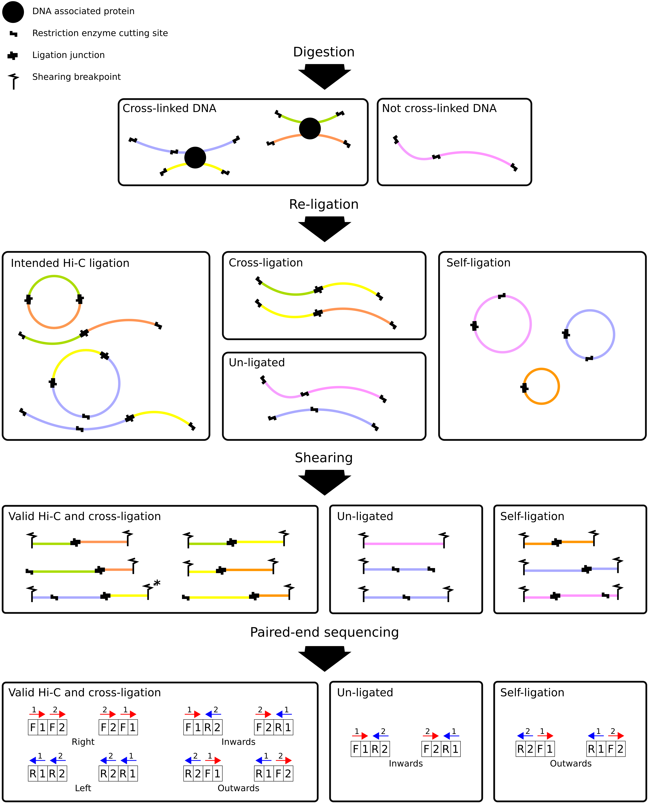

Mapping and categorization of Hi-C paired-end reads
===================================================

Independent mapping of forward and reverse paired-end reads using bowtie2
~~~~~~~~~~~~~~~~~~~~~~~~~~~~~~~~~~~~~~~~~~~~~~~~~~~~~~~~~~~~~~~~~~~~~~~~~

The two reads of any given valid Hi-C read pair stem from two different interacting genomic regions that can be
separated by a large number of nucleotides within the same chromosome (**cis interactions**) or even be located on
different chromosomes (**trans interactions**). For this reason, the distance between the two 5' ends of the reads can
no longer be interpreted as the *insert size*, and the truncated forward (R1) and reverse (R2) reads have to be mapped
independently.

Diachromatic executes ``bowtie2`` separately for R1 and R2 with the ``--very-sensitive`` option. Individual reads mapping
to multiple locations are typically discarded. Diachromatic provides two levels of stringency
for the definition of multi-mapped reads:
    1. **Very stringent definition:** There is no second best alignment for the given read. In this case the line in the SAM file produced by ``bowtie2`` contains no ``XS`` tag. Use Diachromatic's ``--bowtie-stringent-unique`` or ``-bsu`` option in order to use this level of stringency.
    2. **Less stringent definition:** There can be a second best alignment, but the score of the alignment (MAPQ) needs to e greater than 30 and the difference of the mapping scores between the best and second best alignment must be greater than 10. This definition was adopted from HiCUP (version v0.6.0 and higher). Diachromatic uses this option by default.

Pairing of proper mapped read pairs
~~~~~~~~~~~~~~~~~~~~~~~~~~~~~~~~~~~

The independently mapped reads are written to two temporary SAM files, whereby the order of read records in the
truncated FASTQ files is retained by using bowtie2's option ``--reorder``. I a next step, Diachromatic iterates
simultaneously over the two SAM files. Pairs for which at least one read could not be mapped uniquely are discarded,
whereas all other pairs are futher subdivided into different categories comprising valid interaction and artefactual
read pairs arising from shortcomings of the Hi-C protocol.

Categorization of mapped read pairs
~~~~~~~~~~~~~~~~~~~~~~~~~~~~~~~~~~~

Hi-C fragments arise from cross-linked chromatin passing through three successive experimental processing steps:
restriction digest, re-ligation and shearing (see illustration below). Different fragments differ with regard to their
formation history.

For instance, valid Hi-C fragments originate from two pieces of DNA that re-ligated within the same
cross-linked protein-DNA complex, whereas cross-ligation artifacts emerge from re-ligations between different complexes.
The shearing step further increases the diversity of fragments by introducing a second type of fragment end in addition
to the restriction cutting site ends that are also referred to as *dangling ends*. Paired-end sequencing of fragments may
results all possible relative orientations, i.e. reads of given pairs may pointing inwards, outwards or in the same
direction.

Diachromatic uses a predefined fragment size threshold ``-l <size>`` that corresponds to the average size of fragments
after sonication and read pair orientation in order to remove two categories of artifact pairs arising from:
    1. **Un-ligated fragments:** Un-ligated fragments can only result in inward pointing read pairs that are mapped to the same chromosome. The size of un-ligated fragments corresponds to the distance between the 5' end mapping positions of the two reads. If this distance is smaller than the predefined ``<size>``, the read pair is categorized as un-ligated.
    2. **Self-ligated fragments:** Self-ligated fragments can only result in outward pointing read pairs that are mapped to the same chromosome. The size of self-ligated fragments corresponds to distance between the first cutting positions that occur in 3' direction of the 5' end mapping positions of the two reads. If this distance is smaller than the predefined ``<size>``, the read pair is categorized as self-ligated.

All remaining read pairs are referred to as **valid pairs** even though they do not necessarily arise only from genuine
chromatin-chromatin interactions but also from artefactual **cross-ligation** events. These two categories cannot be
distinguished. However, cross-ligation between DNA of different chromosomes (trans) is assumed to occur
more likely than cross-ligation between DNA from the same chromosome (cis). Therefore, the ratio of the numbers of cis
and trans read pairs is taken as an indicator of poor Hi-C libraries that contain lots of false positive interaction
pairs arising from spurious cross-ligation events (Wingett 2015, Nagano 2015).
However, it has also been pointed out that this quality measure depends also on other factors such as the genome size and
number of chromosomes of the analyzed species (Wingett 2015). Diachromatic provides a more robust quality metric that
can be used to access the extent of cross-ligation. Amongst the trans read pairs, we generally observe a large proportion
of restriction fragments that are connected by single read pairs only. The number of all possible different cross-ligation
events (including cis and trans) can roughly be estimated as the square number of all restriction fragments across the
entire genome. Given this huge number, we reasoned that it is very unlikely that the same cross-ligation event occurs
twice. Therefore, we defined a **cross-ligation coefficient (CLC)** as the ratio of singleton read pairs and all read pairs.

The identification of read pairs arising from un-ligated or self-ligated fragments requires the definition of a threshold
``-l <size>`` that corresponds to the **average size of fragments of the Hi-C library**.

Due to the hybrid nature of Hi-C fragments, the determination of the size is not straightforward.

One approach is to determine the distance between 5' end mapping position and the next occurrence cutting motif in 3'
direction separately for each read of a given pair first and then to calculate the sum of the two distances.

This approach that was adopted from HiCUP may yield two small sizes, if the digest was incomplete.

The fragment length estimation
routine of the `peak caller Q`_ be used to estimate the average fragment size of the Hi-C library which is a
suitable value for the self-ligation threshold.

.. _peak caller Q: http://charite.github.io/Q/

Running Diachromatic's align subcommand
~~~~~~~~~~~~~~~~~~~~~~~~~~~~~~~~~~~~~~~

Use the following command to run the alignment and counting step. ::

    $ java -jar Diachromatic.jar align -b <bowtie2> -i <bowtie2-index> -q <fastq1> -r <fastq2> -d <digest> [-o <outfile>]

The meaning of the options is:
    * -b <bowtie2> Path to the bowtie2 executable
    * -i <bowtie2-index> Path to the bowtie2 index for the genome used to map the FASTQ files
    * --q <fastq1> Name and path to the *truncated* "forward" FASTQ file (produced in previous step)
    * --r <fastq2> Name and path to the *truncated* "reverse" FASTQ file (produced in previous step)
    * -d <digest> Path to the digest file produced in the first step
    * [-o <outfile>] This flag is optional and if it is not passed, the default name of ``diachromatic-processed.bam`` will be used.
    * [-x] If this is option is used a set, an additional BAM file for rejected pairs will be created. The general tag for rejected reads is ``YY``. See below for tags of individual artifacts.

For instance, the following command will use bowtie2 to map the two FASTQ files of a paired-end run independently (as it they were single-end sequences). Subsequently, the two resulting mappings will be paired, and pairs that show characteristics of known artifacts will be counted and sorted out. Finally, duplicates will be removed. ::

    $ java -jar target/diachromatic-0.0.2.jar map -b /usr/bin/bowtie2 -i btindex/hg19 -q hindIIIhg19chc/test_dataset1.hindIIIhg19.fastq -r hindIIIhg19chc/test_dataset2.hindIIIhg19.fastq -d hg19HindIIIdigest.txtr -o hindIII

Output files
~~~~~~~~~~~~

Two output files will be produced:

    * ``prefix.valid.bam`` contains all uniquely mapped pairs. Known artifacts and duplicated reads are removed. This file can be used for downstream analyses.

    * ``prefix.rejected.bam`` contains all pairs that show characteristics of known artifacts:

        * insert too long (Tag: ``TB``)
        * insert too short (Tag: ``TS``)
        * circularized read (Tag: ``SL``)
        * same dangling end (Tag: ``DE``)
        * same internal (Tag: ``SI``)
        * re-ligation (Tag: ``RL``)
        * contiguous (Tag: ``CT``)

    * ``prefix.align.stats.``

Read pairs for which one read cannot be mapped or cannot be mapped uniquely (bowtie2: XS:i tag exists) will be discarded completely. Statistics about the numbers of unmappable reads, multimappable reads, and artifact pairs will be written to the screen.

