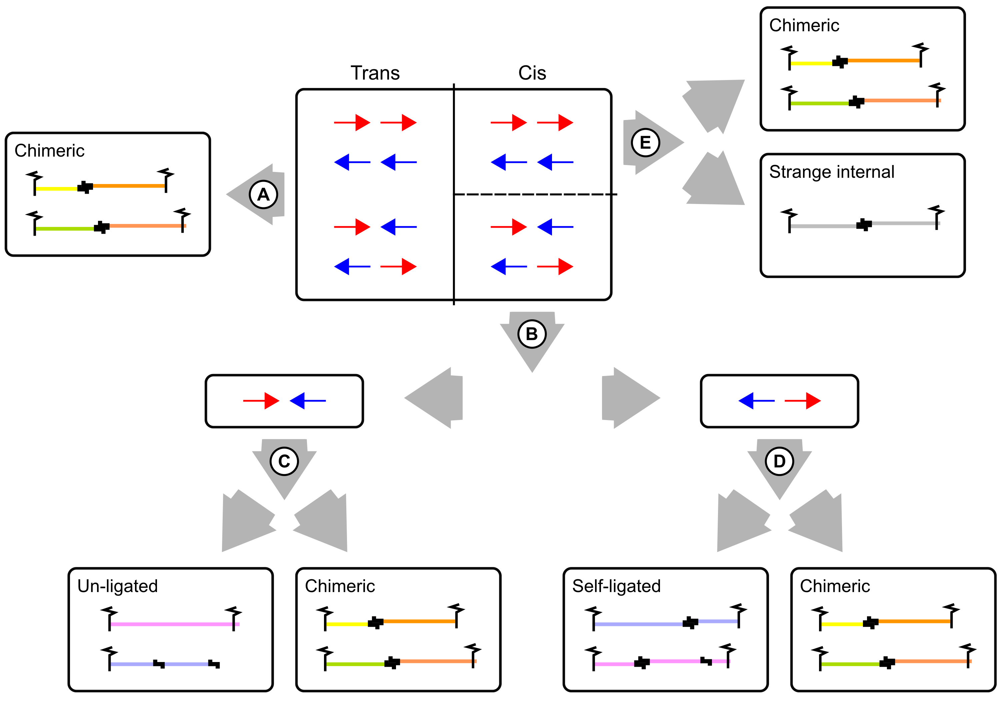

Mapping and categorization of Hi-C reads
========================================

The two reads of a valid Hi-C read pair come from two different interacting genomic regions that can be separated by a large number of nucleotides on the same chromosome (cis) or even be located on different chromosomes (trans). The truncated forward (R1) and reverse (R2) reads have to be mapped independently.

Independent mapping of forward and reverse paired-end reads
~~~~~~~~~~~~~~~~~~~~~~~~~~~~~~~~~~~~~~~~~~~~~~~~~~~~~~~~~~~

Diachromatic separately executes ``bowtie2``  with the ``--very-sensitive`` option for the truncated R1 and R2 reads. Read pairs for which at least one read cannot be mapped uniquely are discarded. Diachromatic provides two levels of stringency for the definition of multi-mapped reads:

1. **Very stringent mapping:** There is no second best alignment for the given read. In this case the line in the SAM record produced by ``bowtie2`` contains no ``XS`` tag. Use Diachromatic's ``--bowtie-stringent-unique`` or ``-bsu`` option in order to use this level of stringency.
2. **Less stringent mapping:** There can be a second best alignment, but the score of the alignment (MAPQ) must be at least 30 and the difference of the mapping scores between the best and second best alignment must be at least 10 (following the recommendation of `HiCUP <https://www.bioinformatics.babraham.ac.uk/projects/hicup/>`_). Diachromatic uses this option by default.

Pairing of properly mapped read pairs
~~~~~~~~~~~~~~~~~~~~~~~~~~~~~~~~~~~~~

The independently mapped reads are written to two temporary SAM files, whereby the order of read records in the truncated FASTQ files is retained by using bowtie2's option ``--reorder``. In the next step, Diachromatic iterates simultaneously over the two SAM files. Read pairs for which both reads can be mapped uniquely are paired, i.e. the two SAM records for single-end reads are combined into one paired-end record with appropriate SAM flags reflecting the relative orientation of the reads.

Categorization of read pairs
----------------------------

Diachromatic distinguishes several read pair categories: (A) Trans reads by definition are chimeric fragments and may represent valid biological interactions or random cross-ligation events. (B) Pairs mapping to different strands of the same chromosome may originate from un-ligated or self-ligated digests. (C) Inward pointing pairs that map to the same digest must have originated from un-ligated fragments. Size thresholds are applied to the remaining fragments to categorize them as valid or artefactual. (D) Outward pointing read pairs that map the same digest must have originated from self-ligated digests. Size thresholds are applied to the remaining fragments to categorize them as valid or artefactual. (E) Read pairs mapping to the same strand can only be chimeric. However, we observe very small proportions of read pairs that are mapped to the same strand and digest. Such read pairs are classified as strange internal.

Running Diachromatic's *align* subcommand
~~~~~~~~~~~~~~~~~~~~~~~~~~~~~~~~~~~~~~~~~

Use the following command to run the alignment step: ::

    $ java -jar target/Diachromatic.jar align \
        -b /usr/bin/bowtie2 \
        -i /data/bt_indices/hg38 \
        -q prefix.truncated_R1.fq.gz \
        -r prefix.truncated_R2.fq.gz \
        -d hg38_DpnII_DigestedGenome.txt \
        -x prefix \
        -o outdir

The table lists all possible arguments:

+--------------+------------------------------+---------------------------------------------+----------+----------------------------------------------------------------------+---------+
| Short option | Long option                  | Example                                     | Required | Description                                                          | Default |
+--------------+------------------------------+---------------------------------------------+----------+----------------------------------------------------------------------+---------+
| -q           | \\-\\-fastq-r1               | prefix.truncated_R1.fq.gz                   | yes      | Path to the truncated forward FASTQ file.                            | --      |
+--------------+------------------------------+---------------------------------------------+----------+----------------------------------------------------------------------+---------+
| -r           | \\-\\-fastq-r2               | prefix.truncated_R2.fq.gz                   | yes      | Path to the truncated forward FASTQ file.                            | --      |
+--------------+------------------------------+---------------------------------------------+----------+----------------------------------------------------------------------+---------+
| -b           | \\-\\-bowtie2                | /tools/bowtie2-2.3.4.1-linux-x86_64/bowtie2 | yes      | Path to bowtie2 executable.                                          | --      |
+--------------+------------------------------+---------------------------------------------+----------+----------------------------------------------------------------------+---------+
| -i           | \\-\\-bowtie2-index          | /data/indices/bowtie2/hg38/hg38             | yes      | Path to bowtie2 index of the corresponding genome.                   | --      |
+--------------+------------------------------+---------------------------------------------+----------+----------------------------------------------------------------------+---------+
| -d           | \\-\\-digest-file            | /data/GOPHER/hg38_DpnII_DigestedGenome.txt  | yes      | Path to the digest file produced with GOPHER.                        | --      |
+--------------+------------------------------+---------------------------------------------+----------+----------------------------------------------------------------------+---------+
| -o           | \\-\\-out-directory          | cd4v2                                       | no       | Directory containing the output of the align subcommand.             | results |
+--------------+------------------------------+---------------------------------------------+----------+----------------------------------------------------------------------+---------+
| -x           | \\-\\-out-prefix             | stim_rep1                                   | no       | Prefix for all generated files in output directory.                  | prefix  |
+--------------+------------------------------+---------------------------------------------+----------+----------------------------------------------------------------------+---------+
| -p           | \\-\\-thread-num             | 15                                          | no       | Number of threads used by bowtie2.                                   | 1       |
+--------------+------------------------------+---------------------------------------------+----------+----------------------------------------------------------------------+---------+
| -j           | \\-\\-output-rejected        | --                                          | no       | If set, a BAM file containing the reject read pairs will be created. | false   |
+--------------+------------------------------+---------------------------------------------+----------+----------------------------------------------------------------------+---------+
| -l           | \\-\\-lower-frag-size-limit  | 50                                          | no       | Lower threshold for the size of sheared fragments.                   | 50      |
+--------------+------------------------------+---------------------------------------------+----------+----------------------------------------------------------------------+---------+
| -u           | \\-\\-upper-frag-size-limit  | 1000                                        | no       | Upper threshold for the size of sheared fragments.                   | 1000    |
+--------------+------------------------------+---------------------------------------------+----------+----------------------------------------------------------------------+---------+
| -s           | \\-\\-self-ligtion-threshold | 3000                                        | no       | Upper threshold for the size of self-ligating fragments.             | 3000    |
+--------------+------------------------------+---------------------------------------------+----------+----------------------------------------------------------------------+---------+
| -k           | \\-\\-keep-sam               | --                                          | no       | Do not delete temporary SAM files.                                   | false   |
+--------------+------------------------------+---------------------------------------------+----------+----------------------------------------------------------------------+---------+

Output files
~~~~~~~~~~~~

The default name of the BAM file containing all unique valid pairs that can be used for downstream analysis is:

    * ``prefix.valid_pairs.aligned.bam``

If ``--output-rejected`` is set, Diachromatic will output a second BAM file cointaing all rejected pairs:

    * ``prefix.rejected_pairs.aligned.bam``

Diachromatic uses optional fields of the SAM records to indicate the read pair category:

    * Un-ligated due to size (Tag: ``UL``)
    * Un-ligated due to same digest (Tag: ``ULSI``)
    * Self-ligated due to size (Tag: ``SL``)
    * Self-ligated due to same digest (Tag: ``SLSI``)
    * Too short chimeric  (Tag: ``TS``)
    * Too long chimeric  (Tag: ``TL``)
    * Valid pair (Tag: ``VP``)

In addition, a file ``prefix.align.stats.txt`` is produced that contains summary statistics about the alignment step.

Finally, an R script ``prefix.frag.sizes.counts.script.R`` is generated that contains fragment size counts and can be
used to generate a plot as shown above.
In order to produce a PDF file, execute the script as follows: ::

    $ Rscript prefix.frag.sizes.counts.script.R

Or source the script from the R environment: ::

    > source("prefix.frag.sizes.counts.script.R")

