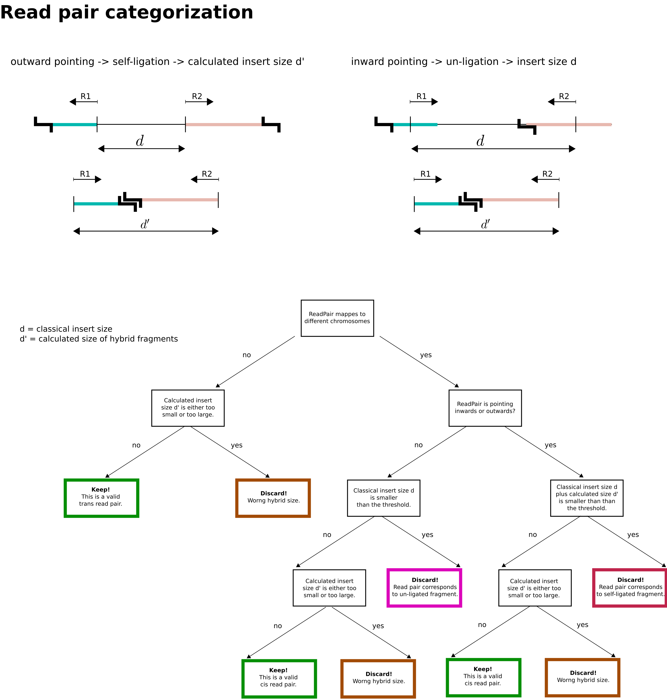

Mapping of paired-end Hi-C reads
================================

Independent mapping of forward and reverse paired-end reads using bowtie2
~~~~~~~~~~~~~~~~~~~~~~~~~~~~~~~~~~~~~~~~~~~~~~~~~~~~~~~~~~~~~~~~~~~~~~~~~

The two reads of any given valid Hi-C read pair stem from two different interacting genomic regions that can be
separated by a large number of nucleotides within the same chromosome (**cis interactions**) or even be located on
different chromosomes (**trans interactions**). For this reason, the distance between the two 5' ends of the reads can
no longer be interpreted as the *insert size*, and the forward (R1) and reverse (R2) reads have to be mapped
independently.

Diachromatic executes ``bowtie2`` two times with the ``--very-sensitive`` option. Individual reads mapping to multiple locations
are typically discarded. Diachromatic provides two levels of stringency
for the definition of multi-mapped reads:
    1. *Very stringent definition:* There is no second best alignment for the given read. In this case the line in the SAM file produced by ``bowtie2`` contains no ``XS`` tag. Use Diachromatic's ``--bowtie-stringent-unique`` or ``-bsu`` option in order to use this level of stringency.
    2. *Less stringent definition:* There can be a second best alignment, but the score of the alignment needs to e greater than 30 and the difference of the mapping scores between the best and second best alignment must be greater than 10. This definition was adopted from HiCUP (since v0.6.0). Diachromatic uses this option by default.

Pairing of proper mapped read pairs
~~~~~~~~~~~~~~~~~~~~~~~~~~~~~~~~~~~

The independently mapped reads are written to two temporary SAM files, whereby the order of reads is the same for both
files, i.e. two reads of any given line consitute a pair. I a next step Diachromatic iterates simultaneously over the
two SAM files. Only pairs for which both reads could be uniquely mapped are retained and all other pairs are discarded.

Categorization of mapped read pairs
~~~~~~~~~~~~~~~~~~~~~~~~~~~~~~~~~~~

Depending on the different formation processes of Hi-C fragments, Diachromatic takes into consideration different
categories of reads pairs. Shearing of re-ligated DNA results in hybrid digests consisting of DNA from two
different genomic loci. Those fragments correspond to valid interactions.

Besides that, there are also fragments that do not contain a ligation junction either because they originate from
genomic regions between cutting sites or because the ends failed to re-ligate. Such fragments must result in inward
pointing pairs of mapped reads, and the length of the fragment corresponds to the distance between the 5' end positions
of the two reads. In Diachromatic, inward pointing read pairs whose 5' end positions have a distance smaller than a
given size threshold are categorized as *unligated-internal*. If the recognition motif of the restriction enzyme occurs
at one 5' ends of the two reads, the pair is categorized as *unligated-dangling*.

Besides the informative valid read pairs, there are also various kinds of artifact read pairs:

    1. **Dangling ends:** If the ends of the two interacting restriction fragments fail to ligate, this will result in fragments that either start or end with the recognition motif of the restriction enzyme. Consequently, also one of the two reads of the corresponding read pair will have the motif at the 5' end.

    2. **Self-ligation:** If within the protein-DNA complexes the two ends of the same fragment ligate, this will result in a fragments that cannot readily be distinguished from valid Hi-C fragments arising from very short range interactions.

    3. **Cross-ligation:** If the ends of two different protein-DNA complexes ligate, this will result in fragments that cannot be distinguished from valid Hi-C fragments.

We found no criterion that could be used in order to distinguish read pairs that emerged from cross-ligation events
from valid read pairs. However, we generally notice a large fraction of trans *interactions* between pairs of restriction
fragments consisting of only one read pair. We believe that those read pairs mainly result from cross-ligation events
and use their total number in order to calculate a global cross-ligation coefficient (CLC).

We also found no accurate way to distinguish between read pairs that emerged from very short range contacts and
self-ligation events. Instead, we use the fact that self-ligation must result only in inward pointing read pairs.
Inward pointing read pairs whose 5' ends have a distance smaller than a user-defined **self-liagtion threshold**
(``-slt``) are flagged as self-ligation artifacts and not used for downstream analyses. The fragment length estimation
routine of the `peak caller Q`_ be used to estimate the average fragment size of the Hi-C library which is a
suitable value for the self-ligation threshold.

.. _peak caller Q: http://charite.github.io/Q/

Running Diachromatic's align subcommand
~~~~~~~~~~~~~~~~~~~~~~~~~~~~~~~~~~~~~~~

Use the following command to run the alignment and counting step. ::

    $ java -jar Diachromatic.jar align -b <bowtie2> -i <bowtie2-index> -q <fastq1> -r <fastq2> -d <digest> [-o <outfile>]

The meaning of the options is:
    * -b <bowtie2> Path to the bowtie2 executable
    * -i <bowtie2-index> Path to the bowtie2 index for the genome used to map the FASTQ files
    * --q <fastq1> Name and path to the *truncated* "forward" FASTQ file (produced in previous step)
    * --r <fastq2> Name and path to the *truncated* "reverse" FASTQ file (produced in previous step)
    * -d <digest> Path to the digest file produced in the first step
    * [-o <outfile>] This flag is optional and if it is not passed, the default name of ``diachromatic-processed.bam`` will be used.
    * [-x] If this is option is used a set, an additional BAM file for rejected pairs will be created. The general tag for rejected reads is ``YY``. See below for tags of individual artifacts.

For instance, the following command will use bowtie2 to map the two FASTQ files of a paired-end run independently (as it they were single-end sequences). Subsequently, the two resulting mappings will be paired, and pairs that show characteristics of known artifacts will be counted and sorted out. Finally, duplicates will be removed. ::

    $ java -jar target/diachromatic-0.0.2.jar map -b /usr/bin/bowtie2 -i btindex/hg19 -q hindIIIhg19chc/test_dataset1.hindIIIhg19.fastq -r hindIIIhg19chc/test_dataset2.hindIIIhg19.fastq -d hg19HindIIIdigest.txtr -o hindIII

Output files
~~~~~~~~~~~~

Two output files will be produced:

    * ``prefix.valid.bam`` contains all uniquely mapped pairs. Known artifacts and duplicated reads are removed. This file can be used for downstream analyses.

    * ``prefix.rejected.bam`` contains all pairs that show characteristics of known artifacts:

        * insert too long (Tag: ``TB``)
        * insert too short (Tag: ``TS``)
        * circularized read (Tag: ``SL``)
        * same dangling end (Tag: ``DE``)
        * same internal (Tag: ``SI``)
        * re-ligation (Tag: ``RL``)
        * contiguous (Tag: ``CT``)

    * ``prefix.align.stats.``

Read pairs for which one read cannot be mapped or cannot be mapped uniquely (bowtie2: XS:i tag exists) will be discarded completely. Statistics about the numbers of unmappable reads, multimappable reads, and artifact pairs will be written to the screen.

