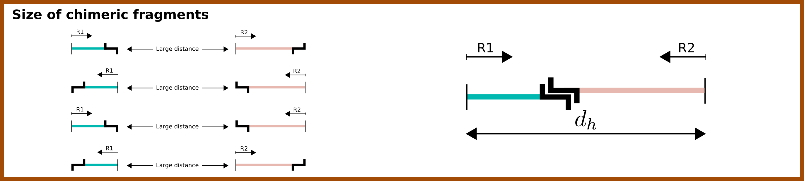
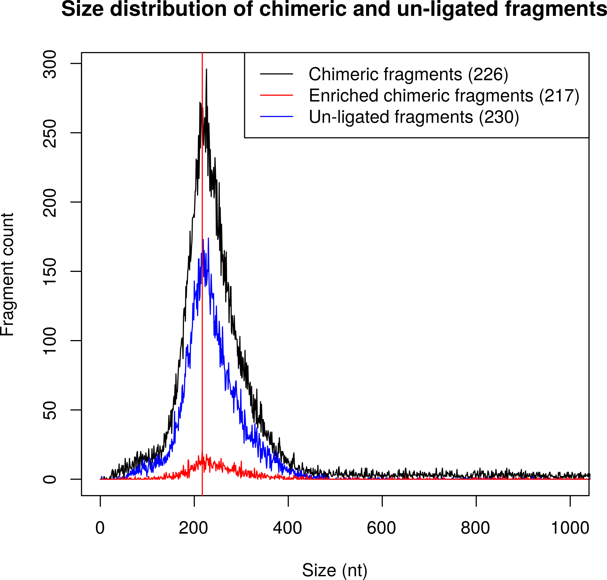

.. _rstalign:
Mapping and categorization of Hi-C paired-end reads
===================================================

Independent mapping of forward and reverse paired-end reads using bowtie2
~~~~~~~~~~~~~~~~~~~~~~~~~~~~~~~~~~~~~~~~~~~~~~~~~~~~~~~~~~~~~~~~~~~~~~~~~

The two reads of a valid Hi-C read pair come from two different interacting genomic regions that can be
separated by a large number of nucleotides within the same chromosome (**cis interactions**) or even be located on
different chromosomes (**trans interactions**). For this reason, the distance between the two 5' end positions of the
mapped reads can no longer be interpreted as the classical *insert size*.
Therefore, the truncated forward (R1) and reverse (R2) reads have to be mapped independently.

Diachromatic separately executes ``bowtie2``  with the ``--very-sensitive`` option for the truncated R1 and R2 reads.
Read pairs for which at least one read cannot be mapped uniquely are discarded.
Diachromatic provides two levels of stringency for the definition of multi-mapped reads:
    1. **Very stringent mapping:** There is no second best alignment for the given read. In this case the line in the SAM record produced by ``bowtie2`` contains no ``XS`` tag. Use Diachromatic's ``--bowtie-stringent-unique`` or ``-bsu`` option in order to use this level of stringency.
    2. **Less stringent mapping:** There can be a second best alignment, but the score of the alignment (MAPQ) needs to e greater or equal than 30 and the difference of the mapping scores between the best and second best alignment must be greater or equal than 10 (following the recommendation of `HiCUP <https://www.bioinformatics.babraham.ac.uk/projects/hicup/>`_). Diachromatic uses this option by default.

Pairing of properly mapped read pairs
~~~~~~~~~~~~~~~~~~~~~~~~~~~~~~~~~~~~~

The independently mapped reads are written to two temporary SAM files, whereby the order of read records in the
truncated FASTQ files is retained by using bowtie2's option ``--reorder``. In the next step, Diachromatic iterates
simultaneously over the two SAM files.
Read pairs for which both reads can be mapped uniquely are paired, i.e. the two SAM records for single-end reads are
combined into one paired-end record with appropriate SAM flags reflecting the relative orientation of the reads.

Formation of Hi-C fragments
~~~~~~~~~~~~~~~~~~~~~~~~~~~

Read pairs are divided into valid and artefactual read pairs.
In order to understand how Diachromatic determines whether a read pair is valid or not, it is important to
 understand the process by which Hi-C fragments are formed.
Hi-C fragments arise from cross-linked chromatin that is processed in three successive experimental steps:
*restriction digest*, *re-ligation* and *shearing* (see illustration below).

.. figure:: img/fragment_formation.png
    :align: center

Cross-linked chromatin is digested using one or more restriction enzymes,
which results in restriction fragments whose ends re-ligate thereby forming ligation junctions.
The shearing step introduces ("random") DNA breakpoints representing a second type of fragment ends in addition those introduced
by digestion. Fragment ends corresponding to restriction enzyme cutting sites are generally referred to as
*dangling ends* because they failed to re-ligate.
Essentially, three fragment categories are distinguished within Diachromatic: **chimeric fragments** that arise from
re-ligation between ends of different restriction fragments as well as two artifact categories that correspond to single
restriction fragments whose ends failed to re-ligate with other fragments, either because both ends remained **un-ligated**
or **self-ligated** with each other.
Chimeric fragments may correspond to genuine interactions but also to *cross-ligation*
artifacts depending on whether the re-ligation occurred within the same protein-DNA complex or between different complexes.

Paired-end sequencing of chimeric fragments may result in all possible relative orientations, i.e. reads of given pairs
may point *inwards*, *outwards* or in the *same direction*.
In contrast to that, sequencing of un-ligated fragments results in inward pointing pairs only, and sequencing of
self-ligated fragments results in outward pointing pairs only.
Due to the fact that the read pair orientations overlap
for the different categories, the identification of read pairs arising from un-ligated or self-ligated fragments
additionally requires the definition of size thresholds that will be introduced below.

Sizes of chimeric fragments
---------------------------

Read pairs arising from chimeric fragments may have all possible relative orientations, and the size needs to be calculated
in consideration of the Hi-C protocol.
This size is here referred to as d\ :sub:`c` and calculated as the sum of the two distances between the 5' ends of the
mapped reads and the next occurrence of a cutting motif in 3' direction which is assumed to correspond to the ligation
junction (`Wingett 2015 <https://www.ncbi.nlm.nih.gov/pubmed/26835000/>`_).

We assume that the size distribution of chimeric fragments results from the parameters used for shearing
and thus corresponds to overall fragment size distribution in the sequencing library.
Diachromatic uses lower  and upper thresholds T1\ :sub:`min` and T1\ :sub:`max` for valid sizes of sheared fragments.
These parameters can be specified by the user using the flags ``-l`` (Default: 50) and ``-u`` (Default: 800) and should be set according to
the expected distribution of sizes of shared fragments within the library.
Read pairs arising from chimeric fragments with a calculated size d\ :sub:`c` that is outside the specified range are
categorized as *too small* or *too large* artifacts.
All other read pairs arising from chimeric fragments are defined to be *valid pairs* that can be used for downstream
analysis.

Sizes of un-ligated fragments
-----------------------------

Read pairs arising from un-ligated fragments must point inwards, and the fragment size simply corresponds to the
distance between the 5' end positions of the two reads. This distance is here referred to as d\ :sub:`u`.

In order decide whether a given read pair originates from a chimeric or an un-ligated fragment, Diachromatic
uses the same upper threshold T1\ :sub:`max` that is also used for  chimeric fragments.
This is because we assume the size distributions both for chimeric and un-ligated fragments to be the result of the same shearing
step.
Inward pointing read pairs for which d\ :sub:`u` is smaller than the user defined threshold T1\ :sub:`max` are categorized as
un-ligated pairs.
Furthermore, inward pointing read pairs that map to the same digest are categorized as un-ligated pairs.

Sizes of self-ligated fragments
-------------------------------

Unlike read pairs arising from un-ligated fragments, self-ligated read pairs must point outwards.
Furthermore, self-ligating fragments have a different size distribution than chimeric and un-ligated fragments.
The relevant sizes are no longer those of the sequenced fragments but the favourable size at which fragments tend to
self-ligate.
Very short fragments might not self-ligate because of steric hindrance, whereas the ends of very long fragments might
be unlikely to become located in sufficient physical proximity in order to ligate.
Within Diachromatic, the size of self-ligating fragments is calculated as the sum d\ :sub:`s` = d\ :sub:`c` + d\ :sub:`u`,
where d\ :sub:`u` is the distance between the 5' end positions of the two reads, and d\ :sub:`c` is the sum of the two
distances between the 5' ends of the mapped reads and the next occurrence of a cutting motif in 3' direction.

Outward pointing read pairs for which the calculated size d\ :sub:`s` is smaller than a user defined self-ligation
threshold T2\ :sub:`max` are categorized as self-ligated pairs.
Furthermore, outward pointing read pairs that map to the same digest are categorized as self-ligated pairs.

Categorization of read pairs
----------------------------

Diachromatic distinguishes five disjoint read pair categories:

**1. Un-ligated:** The read pair points inwards and the distance between the two 5' end positions d\ :sub:`u` is smaller than T1\ :sub:`max` or both reads map to the same digest.

**2. Self-ligated:** The read pair points outwards and the calculated size of self-ligating fragments d\ :sub:`s` is smaller than a predefined self-ligation threshold T2\ :sub:`max` (Default: 3000) or both reads map to the same digest.

**3. Short chimeric:** The read pair is not in the un-ligated or self-ligated category and the calculated size d\ :sub:`c` is smaller than a specified lower threshold threshold T1\ :sub:`min` (Default: 50).

**4. Long chimeric:** The read pair  is not in the un-ligated or self-ligated category and the calculated size d\ :sub:`c` is greater than a specified lower threshold T1\ :sub:`max` (Default: 800).

**5. Valid (chimeric):** All remaining chimeric read pairs.

The illustration below shows the decision tree for the categorization of read pairs.

.. figure:: img/fragment_categories.png
    :align: center

The decision as to whether a read-pair is valid or not is made according to the four decision nodes shown in the Figure:

**1.** Read pairs that map to different chromosomes or to the same strand cannot originate from un-ligated or self-ligated fragments. Therefore, they are categorized as chimeric read pairs that are valid, if the size d\ :sub:`s` is within the specified range.

**2.** Read pairs that point inwards might originate from un-ligated fragments. In such cases, the distance between the 5' end positions of the mapped reads d\ :sub:`u` corresponds to the size of the  sequenced fragment. In order to assign read pairs to the un-ligated category, we use an upper size threshold T\ :sub:`1` that should reflect the maximum plausible size of sheared fragments. Furthermore, inward pointing read pairs that map to the same digest are categorized as un-ligated.

**3.** Read pairs that point outwards might originate from self-ligated fragments. In such cases, the size d\ :sub:`s` of the potentially underlying self-ligated fragment is calculated as described above, and compared to an upper size threshold T\ :sub:`2` for self-ligated fragments. Outward pointing read pairs with d\ :sub:`s` smaller than T\ :sub:`2` are assigned to the self-ligated category. Furthermore, outward pointing read pairs that map to the same digest are categorized as self-ligated.

**4.** Read pairs arising from chimeric fragments (not un- or self-ligated) are further distinguished. Read pairs with size d\ :sub:`s` outside the specified size range of sheared fragments will be categorizesd as too small or too large, and all remaining read pairs are categorized as valid.

Dangling end read pairs
-----------------------

Fragment ends that corresponding to restriction enzyme cutting sites are referred to as dangling ends.
In theory, fragments of all categories may have dangling ends. Therefore, there is no separate class for dangling ends.
However, the number of dangling end read pairs within each of the five disjoint categories is determined and reported.

Trans read pairs
----------------

Trans read pairs (i.e., read pairs in which the read map to different chromosomes)
may have each of the eight possible orientations but they must be chimeric by
definition. The number of trans read pairs is determined and reported for each read pair category.
For the categories un-ligated and self-ligated the number of trans pairs must be zero.

Dichromatic vs. HiCUP categories
--------------------------------

When HiCUP is executed with the ``--keep`` flag, it will create a directory containing BAM files for the individual read pair
categories. We applied HiCUP to the associated test data, converted the BAM files back to FASTQ format
and applied Diachromatic to the FASTQ files.

The following table shows the numbers of read pairs within the categories of HiCUP and Diachromatic.

For instance, HiCUP categorized 13,760 read pairs as *same internal* and 13,722 of these are uniquely mapped using Diachromatic.
The small differences between these numbers may be due to different bowtie versions or settings.
13,645 of these uniquely mapped read pairs are categorized as un-ligated, which is the correct category for those read pairs
because according to our logic *same internal* read pairs correspond to un-ligated fragments.
However, in total 77 *same internal* read pairs are categorized as *chimeric* read pairs, which is contradictory.
Further investigation revealed that the 5' end positions of those read pairs are indeed mapped to the same digest but also to the same strand.
According to the logic implemented in Diachromatic (see decision tree) read pairs mapped to the same strand are automatically categorized as chimeric,
because the concept of the Hi-C fragment formation cannot explain such read pairs.

The next HiCUP category is *re-ligation*. For Diachromatic, all 1060 read pairs are mapped uniquely.
58 read pairs are categorized as *self-ligated*. Further investigation of these read pairs revealed that all pairs
are outward pointing, which is correct for *self-ligated* pairs.
The 5 *re-ligation* read pairs that are categorized as *chimeric too short* are outward pointing as well but d\ :sub:`u` is greater than
the self-ligation threshold. However, the calcluated size calculated d\ :sub:`c` is smaller than lower threshold for sheared fragments.

+------------------------------------------------------+-----------------------+-----------------------------+------------------+--------------------+--------------------------+-------------------------+-------------+
| **HiCUP** (rows) vs. **Diachromatic** (columns)      | **# Processed pairs** | **# Uniquely mapped pairs** | **# Un-ligated** | **# Self-ligated** | **# Chimeric too short** | **# Chimeric too long** | **# Valid** |
+------------------------------------------------------+-----------------------+-----------------------------+------------------+--------------------+--------------------------+-------------------------+-------------+
| **Same internal**                                    |                13,760 |                      13,722 |       **13,645** |                  0 |                       13 |                      39 |          25 |
+------------------------------------------------------+-----------------------+-----------------------------+------------------+--------------------+--------------------------+-------------------------+-------------+
| **Re-ligation**                                      |                 1,060 |                       1,060 |          **842** |                 58 |                        5 |                      49 |         106 |
+------------------------------------------------------+-----------------------+-----------------------------+------------------+--------------------+--------------------------+-------------------------+-------------+
| **Contiguous**                                       |                    58 |                          58 |           **53** |                  0 |                        1 |                       0 |           4 |
+------------------------------------------------------+-----------------------+-----------------------------+------------------+--------------------+--------------------------+-------------------------+-------------+
| **Same circularised**                                |                   428 |                         428 |                3 |            **425** |                        0 |                       0 |           0 |
+------------------------------------------------------+-----------------------+-----------------------------+------------------+--------------------+--------------------------+-------------------------+-------------+
| **Wrong size**                                       |                10,321 |                      10,267 |                2 |                  0 |                **1,003** |               **9,181** |          81 |
+------------------------------------------------------+-----------------------+-----------------------------+------------------+--------------------+--------------------------+-------------------------+-------------+
| **Valid**                                            |                25,915 |                      25,851 |                1 |                  5 |                      290 |                       6 |  **25,549** |
+------------------------------------------------------+-----------------------+-----------------------------+------------------+--------------------+--------------------------+-------------------------+-------------+
|                                                      |                       |                             |                  |                    |                          |                         |             |
+------------------------------------------------------+-----------------------+-----------------------------+------------------+--------------------+--------------------------+-------------------------+-------------+
| **Same dangling ends**                               |                 2,475 |                       2,473 |        **2,470** |                  0 |                        1 |                       2 |           0 |
+------------------------------------------------------+-----------------------+-----------------------------+------------------+--------------------+--------------------------+-------------------------+-------------+

The HiCUP categories same internal, re-ligation and contiguous corresponds to Diachromatic's un-ligated category.
HiCUP's same circularised category corresponds to the self-ligated category.
The wrong size category is corresponds to the sum of too short and too large chimeric fragments.
99% of HiCUP's valid read pairs are also categorized as valid within Diachromatic.

Quality metrics
~~~~~~~~~~~~~~~
Diachromatic outputs a text file with the quality metrics for each run. The following texts provides possible interpretations
of these quality metrics and exemplary numbers for the `CTCF depletion Hi-C datasets of Nora et al. 2017`_.

.. _CTCF depletion Hi-C datasets of Nora et al. 2017: https://www.ncbi.nlm.nih.gov/pubmed/2852575

Percentage of uniquely mapped pairs
-----------------------------------

Percentage of truncated input read pairs that were paired, i.e. both reads were uniquely mapped to the genome.
For the CTCF depletion datasets, percentages range from 48.54% to 56.66%.

Hi-C pair duplication rate (HPDR)
---------------------------------

For Hi-C, the removal of duplicates must take into account the chimeric nature of the underlying fragments.
The HPDR is defined as the percentage of uniquely mapped pairs that were removed because they were recognized to be *Hi-C duplicates*.
Usually, high duplication rates indicate sequencing libraries with low complexity.
For the CTCF depletion data, the proportion of unique read pairs amongst all uniquely mapped read pairs ranges between
1.26% and 21.13%.

Percentages of different read pair categories
---------------------------------------------

The categorization scheme subdivides the set of all uniquely mapped unique pairs into disjoint subsets.
The percentages of the individual categories may be useful for experimental troubleshooting.

**Percentage of un-ligated read pairs:** High percentages of un-ligated pairs indicate poor enrichment for ligation junctions, i.e. the streptavidin pull-down of biotinylated Hi-C ligation did not perform well. For the CTCF depletion data, the percentages of un-ligated pairs range between 9.61% and 26.17%.

**Percentage of self-ligated read pairs:** In practice, self-ligation seems not to occur  very often. For the CTCF depletion data, the percentages of self-ligated pairs range between 0.95% and 1.89%.

**Percentage of too short chimeric read pairs:** A high percentage (5%<) of too short chimeric fragments may indicate that the chosen lower size threshold for sheared fragments (``-l``) does not match the experimental settings. Diachromatic generates a plot for distribution of fragment sizes (see below) may provide guidance.

**Percentage of too large chimeric read pairs:** Essentially, the same applies as for the too short chimeric category.

**Percentage of valid read pairs:** The more, the better. For the the CTCF depletion data, percentages range between 62.30% and 81.35%.

Yield of valid pairs (YVP)
--------------------------

Percentage of truncated input read pairs that were finally categorized as valid pairs usable for downstream analysis.
The YVP is intended to reflect the overall efficiency of the Hi-C protocol.
For the the CTCF depletion data, the percentages range between 24.37% and 42.77%.

Cross-ligation coefficient (CLC)
--------------------------------

Valid read pairs arising from genuine chromatin-chromatin interactions between different chromosomes cannot be
distinguished from those arising from **cross-ligation** events.
Based on the assumption that random cross-ligations between DNA fragments of different chromosomes (*trans*) occur more
likely as compared to cross-ligations between DNA fragments of the same chromosome (*cis*), the ratio of the numbers of cis
and trans read pairs is taken as an indicator of poor Hi-C libraries (Wingett 2015, Nagano 2015).
Within Diachromatic, the CLC is calculated as proportion of trans read pairs amongst all uniquely mapped unique pairs.
For the CTCF depletion dataset, percentages range between 18.48% and 28.24%.

Re-ligation coefficient (RLC)
-----------------------------

Percentage of uniquely mapped unique pairs that did not arise from fragments with dangling-ends, i.e. ends that correspond
to un-ligated restriction enzyme cutting sites.
The RLC is intended to reflect the efficiency of the re-ligation step
and could possibly be used to improve experimental
conditions for re-ligation.
For the CTCF depletion dataset, percentages range between 97.04% and 98.92%.

Size distribution of chimeric and un-ligated fragments
------------------------------------------------------

The plot of fragment size distributions is intended to serve as a kind of sanity check.
Deviations from bell-shaped curve progressions should be thoroughly scrutinized.
Furthermore, the plot might be useful for the adjustment of Diachromatic's size thresholds T1\ :sub:`min` and T1\ :sub:`max`.
For instance, a high number of read pairs that are categorized as *too large* could indicate that the actual size of
sheared fragments is larger on average.
In such cases, the plot can be used to choose good thresholds.

For the size distribution of chimeric fragments (**black**), the chimeric sizes of all read pairs that were categorized
as either as *valid*, *too short* or *too long* are determined.
Enriched chimeric fragments (**red**) form a subset of all chimeric fragments, whereby either the read R1 or R2 is assigned
to a digest that is flagged as selected in the digest file passed to Diachromatic.
For the size distribution of un-ligated fragments (**blue**) the distances between all inward pointing read pairs mapping
to the same chromosome (*cis*) are determined.

Running Diachromatic's *align* subcommand
~~~~~~~~~~~~~~~~~~~~~~~~~~~~~~~~~~~~~~~~~

Use the following command to run the alignment step. ::

    $ java -jar target/Diachromatic.jar align \
        -b /usr/bin/bowtie2 \
        -i /data/bt_indices/hg38 \
        -q prefix.truncated_R1.fq.gz \
        -r prefix.truncated_R2.fq.gz \
        -d hg38_DpnII_DigestedGenome.txt

The following table lists all possible arguments.

+--------------+--------------------------+---------------------------------------------+----------+----------------------------------------------------------------------+---------+
| Short option | Long option              | Example                                     | Required | Description                                                          | Default |
+--------------+--------------------------+---------------------------------------------+----------+----------------------------------------------------------------------+---------+
| -q           | --fastq-r1               | prefix.truncated_R1.fq.gz                   | yes      | Path to the truncated forward FASTQ file.                            | --      |
+--------------+--------------------------+---------------------------------------------+----------+----------------------------------------------------------------------+---------+
| -r           | --fastq-r2               | prefix.truncated_R2.fq.gz                   | yes      | Path to the truncated forward FASTQ file.                            | --      |
+--------------+--------------------------+---------------------------------------------+----------+----------------------------------------------------------------------+---------+
| -b           | --bowtie2                | /tools/bowtie2-2.3.4.1-linux-x86_64/bowtie2 | yes      | Path to bowtie2 executable.                                          | --      |
+--------------+--------------------------+---------------------------------------------+----------+----------------------------------------------------------------------+---------+
| -i           | --bowtie2-index          | /data/indices/bowtie2/hg38/hg38             | yes      | Path to bowtie2 index of the corresponding genome.                   | --      |
+--------------+--------------------------+---------------------------------------------+----------+----------------------------------------------------------------------+---------+
| -d           | --digest-file            | /data/GOPHER/hg38_DpnII_DigestedGenome.txt  | yes      | Path to the digest file produced with GOPHER.                        | --      |
+--------------+--------------------------+---------------------------------------------+----------+----------------------------------------------------------------------+---------+
| -o           | --out-directory          | cd4v2                                       | no       | Directory containing the output of the align subcommand.             | results |
+--------------+--------------------------+---------------------------------------------+----------+----------------------------------------------------------------------+---------+
| -x           | ---out-prefix            | stim_rep1                                   | no       | Prefix for all generated files in output directory.                  | prefix  |
+--------------+--------------------------+---------------------------------------------+----------+----------------------------------------------------------------------+---------+
| -p           | --thread-num             | 15                                          | no       | Number of threads used by bowtie2.                                   | 1       |
+--------------+--------------------------+---------------------------------------------+----------+----------------------------------------------------------------------+---------+
| -j           | --output-rejected        | --                                          | no       | If set, a BAM file containing the reject read pairs will be created. | false   |
+--------------+--------------------------+---------------------------------------------+----------+----------------------------------------------------------------------+---------+
| -l           | --lower-frag-size-limit  | 50                                          | no       | Lower threshold for the size of sheared fragments.                   | 50      |
+--------------+--------------------------+---------------------------------------------+----------+----------------------------------------------------------------------+---------+
| -u           | --upper-frag-size-limit  | 1000                                        | no       | Upper threshold for the size of sheared fragments.                   | 1000    |
+--------------+--------------------------+---------------------------------------------+----------+----------------------------------------------------------------------+---------+
| -s           | --self-ligtion-threshold | 3000                                        | no       | Upper threshold for the size of self-ligating fragments.             | 3000    |
+--------------+--------------------------+---------------------------------------------+----------+----------------------------------------------------------------------+---------+

Output files
~~~~~~~~~~~~

The default name of the BAM file containing all unique valid pairs that can be used for downstream analysis is:

    * ``prefix.valid_pairs.aligned.bam``

If ``--output-rejected`` is set, Diachromatic will output a second BAM file cointaing all rejected pairs:

    * ``prefix.rejected_pairs.aligned.bam``

Diachromatic uses optional fields of the SAM records to indicate the read pair category:

    * Un-ligated due to size (Tag: ``UL``)
    * Un-ligated due to same digest (Tag: ``ULSI``)
    * Self-ligated due to size (Tag: ``SL``)
    * Self-ligated due to same digest (Tag: ``SLSI``)
    * Too short chimeric  (Tag: ``TS``)
    * Too long chimeric  (Tag: ``TL``)
    * Valid pair (Tag: ``VP``)

Furthermore, there is an ``RO`` attribute that indicates the relative orientation of the pair:

    * Same strand forward: ``F1F2``, ``F2F1``
    * Same strand reverse: ``R1R2``, ``R2R1``
    * Inwards: ``F1R2``, ``F2R1``
    * Outwards: ``R2F1``, ``R1F2``

In addition, a file ``prefix.align.stats.txt`` is produced that contains summary statistics about the alignment step.

Finally, an R script ``prefix.frag.sizes.counts.script.R`` is generated that contains fragment size counts and can be
used to generate a plot as shown above.
In order to produce a PDF file, execute the script as follows: ::

    $ Rscript prefix.frag.sizes.counts.script.R

Or source the script from the R environment: ::

    > source("prefix.frag.sizes.counts.script.R")

