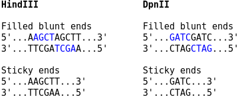

.. _rsttruncate:

Truncation of chimeric reads
============================

Valid Hi-C read pairs originate from chimeric fragments with DNA from two different loci linked by the ligation junction. Diachromatic searches read sequences in 5’-3’ direction and truncates chimeric reads at the location of the ligation site, thereby removing the following sequence.

For Capture Hi-C, the sticky ends are filled in with biotinylated nucleotides, and the resulting blunt ends are ligated. The corresponding ligation junctions can then be observed as two consecutive copies of the overhang sequence at restriction enzyme cutting sites. For Capture-C, no fill in of the overhangs is performed, and the ligation junctions occur as plain restriction sites.

Use the ``--sticky-ends`` option if no fill in was performed.

Running the *truncate* subcommand
~~~~~~~~~~~~~~~~~~~~~~~~~~~~~~~~~

Use the following command to run the truncation step: ::

    $ java -jar Diachromatic.jar truncate \
        -q test_1.fastq \
        -r test_2.fastq \
        -e HinDIII \
        -x prefix \
        -o outdir

Available arguments:

+--------------+---------------------+---------------+----------+----------------------------------------------------------+---------+
| Short option |     Long option     | Example       | Required | Description                                              | Default |
+--------------+---------------------+---------------+----------+----------------------------------------------------------+---------+
| -q           | \\-\\-fastq-r1      | forward.fq.gz | yes      | Path to the forward FASTQ file.                          |    --   |
+--------------+---------------------+---------------+----------+----------------------------------------------------------+---------+
| -r           | \\-\\-fastq-r2      | reverse.fq.gz | yes      | Path to the reverse FASTQ file.                          |    --   |
+--------------+---------------------+---------------+----------+----------------------------------------------------------+---------+
| -e           | \\-\\-enzyme        | HindIII       | yes      | Symbol of the restriction enzyme.                        | null    |
+--------------+---------------------+---------------+----------+----------------------------------------------------------+---------+
| -s           | \\-\\-sticky-ends   | false         | no       | True, if no fill-in of sticky ends was performed.        | false   |
+--------------+---------------------+---------------+----------+----------------------------------------------------------+---------+
| -o           | \\-\\-out-directory | cd4v2         | yes      | Directory containing the output of the truncate command. | results |
+--------------+---------------------+---------------+----------+----------------------------------------------------------+---------+
| -x           | \\-\\-out-prefix    | stim_rep1     | yes      | Prefix for all generated files in output directory.      | prefix  |
+--------------+---------------------+---------------+----------+----------------------------------------------------------+---------+

Output files
~~~~~~~~~~~~

The default names of the truncated and gzipped FASTQ files are:

    * ``prefix.truncated_R1.fastq.gz``
    * ``prefix.truncated_R2.fastq.gz``

In addition, a file is produced that contains summary statistics about the truncation step.

    * ``prefix.truncation.stats.txt``

